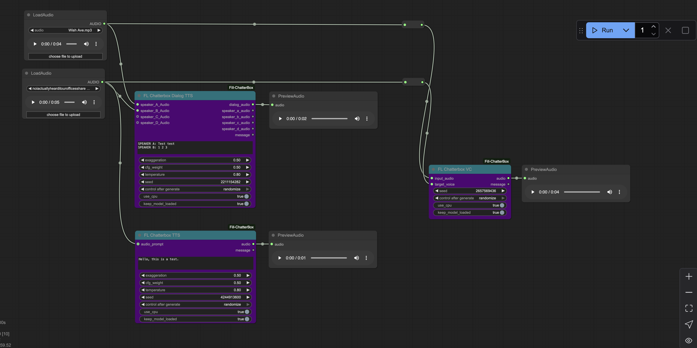

<div align="right">
  <details>
    <summary >🌐 Language</summary>
    <div>
      <div align="center">
        <a href="https://openaitx.github.io/view.html?user=filliptm&project=ComfyUI_Fill-ChatterBox&lang=en">English</a>
        | <a href="https://openaitx.github.io/view.html?user=filliptm&project=ComfyUI_Fill-ChatterBox&lang=zh-CN">简体中文</a>
        | <a href="https://openaitx.github.io/view.html?user=filliptm&project=ComfyUI_Fill-ChatterBox&lang=zh-TW">繁體中文</a>
        | <a href="https://openaitx.github.io/view.html?user=filliptm&project=ComfyUI_Fill-ChatterBox&lang=ja">日本語</a>
        | <a href="https://openaitx.github.io/view.html?user=filliptm&project=ComfyUI_Fill-ChatterBox&lang=ko">한국어</a>
        | <a href="https://openaitx.github.io/view.html?user=filliptm&project=ComfyUI_Fill-ChatterBox&lang=hi">हिन्दी</a>
        | <a href="https://openaitx.github.io/view.html?user=filliptm&project=ComfyUI_Fill-ChatterBox&lang=th">ไทย</a>
        | <a href="https://openaitx.github.io/view.html?user=filliptm&project=ComfyUI_Fill-ChatterBox&lang=fr">Français</a>
        | <a href="https://openaitx.github.io/view.html?user=filliptm&project=ComfyUI_Fill-ChatterBox&lang=de">Deutsch</a>
        | <a href="https://openaitx.github.io/view.html?user=filliptm&project=ComfyUI_Fill-ChatterBox&lang=es">Español</a>
        | <a href="https://openaitx.github.io/view.html?user=filliptm&project=ComfyUI_Fill-ChatterBox&lang=it">Italiano</a>
        | <a href="https://openaitx.github.io/view.html?user=filliptm&project=ComfyUI_Fill-ChatterBox&lang=ru">Русский</a>
        | <a href="https://openaitx.github.io/view.html?user=filliptm&project=ComfyUI_Fill-ChatterBox&lang=pt">Português</a>
        | <a href="https://openaitx.github.io/view.html?user=filliptm&project=ComfyUI_Fill-ChatterBox&lang=nl">Nederlands</a>
        | <a href="https://openaitx.github.io/view.html?user=filliptm&project=ComfyUI_Fill-ChatterBox&lang=pl">Polski</a>
        | <a href="https://openaitx.github.io/view.html?user=filliptm&project=ComfyUI_Fill-ChatterBox&lang=ar">العربية</a>
        | <a href="https://openaitx.github.io/view.html?user=filliptm&project=ComfyUI_Fill-ChatterBox&lang=fa">فارسی</a>
        | <a href="https://openaitx.github.io/view.html?user=filliptm&project=ComfyUI_Fill-ChatterBox&lang=tr">Türkçe</a>
        | <a href="https://openaitx.github.io/view.html?user=filliptm&project=ComfyUI_Fill-ChatterBox&lang=vi">Tiếng Việt</a>
        | <a href="https://openaitx.github.io/view.html?user=filliptm&project=ComfyUI_Fill-ChatterBox&lang=id">Bahasa Indonesia</a>
      </div>
    </div>
  </details>
</div>

# ComfyUI_Fill-ChatterBox

If you enjoy this project, consider supporting me on Patreon!
<p align="left">
  <a href="https://www.patreon.com/c/Machinedelusions">
    
  </a>
</p>

A custom node extension for ComfyUI that adds text-to-speech (TTS) and voice conversion (VC) capabilities using the Chatterbox library.
Supports a MAXIMUM of 40 seconds. Iv tried removing this limitation, but the model falls apart really badly with anything longer than that, so it remains.



## Installation

1. Clone this repository into your ComfyUI custom_nodes directory:
   ```bash
   cd /path/to/ComfyUI/custom_nodes
   git clone https://github.com/filliptm/ComfyUI_Fill-ChatterBox.git
   ```

2. Install the base dependencies:
   ```bash
   pip install -r ComfyUI_Fill-ChatterBox/requirements.txt
   ```

3. (Optional) Install watermarking support:
   ```bash
   pip install resemble-perth
   ```
   **Note**: The `resemble-perth` package may have compatibility issues with Python 3.12+. If you encounter import errors, the nodes will still function without watermarking.


## Usage

### Text-to-Speech Node (FL Chatterbox TTS)
- Add the "FL Chatterbox TTS" node to your workflow
- Configure text input and parameters (exaggeration, cfg_weight, temperature)
- Optionally provide an audio prompt for voice cloning

### Voice Conversion Node (FL Chatterbox VC)
- Add the "FL Chatterbox VC" node to your workflow
- Connect input audio and target voice
- Both nodes support CPU fallback if CUDA errors occur

## Change Log

### 6/24/2025
- Added seed parameter to both TTS and VC nodes for reproducible generation
- Seed range: 0 to 4,294,967,295 (32-bit integer)
- Enables consistent audio output for debugging and workflow control
- Made Perth watermarking optional to fix Python 3.12+ compatibility issues
- Nodes now function without watermarking if resemble-perth import fails

### 5/31/2025
- Added Persistent model loading, and loading bar functionality
- Added Mac support (needs to be tested so HMU)
- removed the chatterbox-tts library and implemented native inference code.

